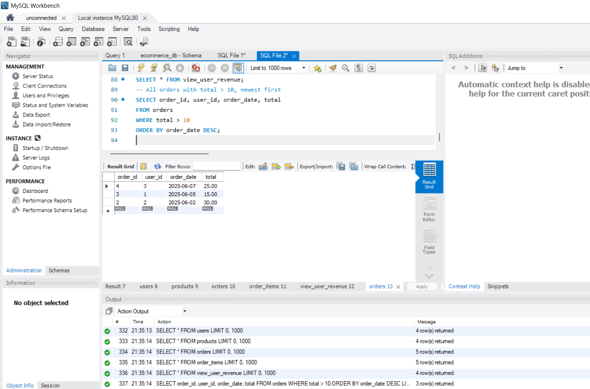
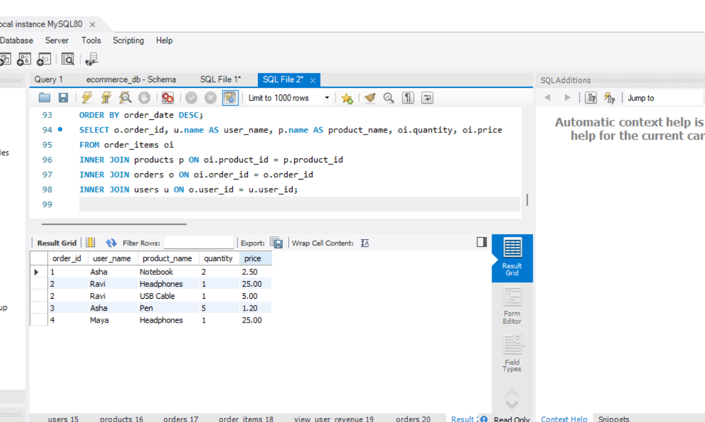
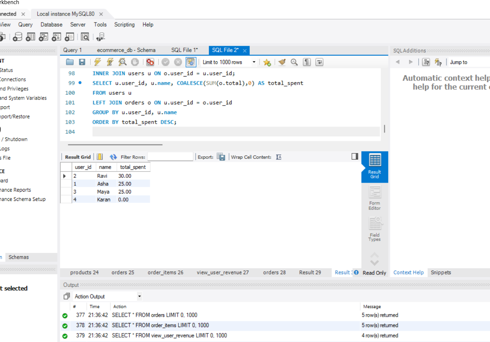
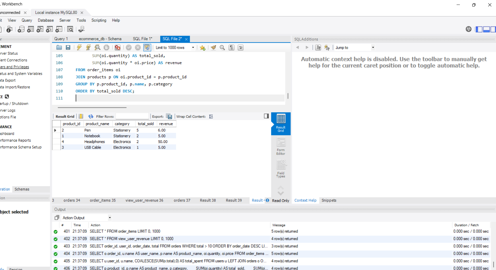
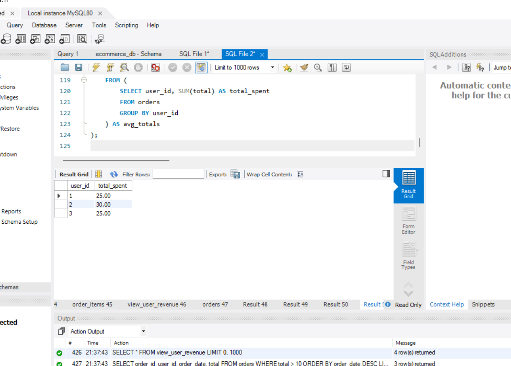
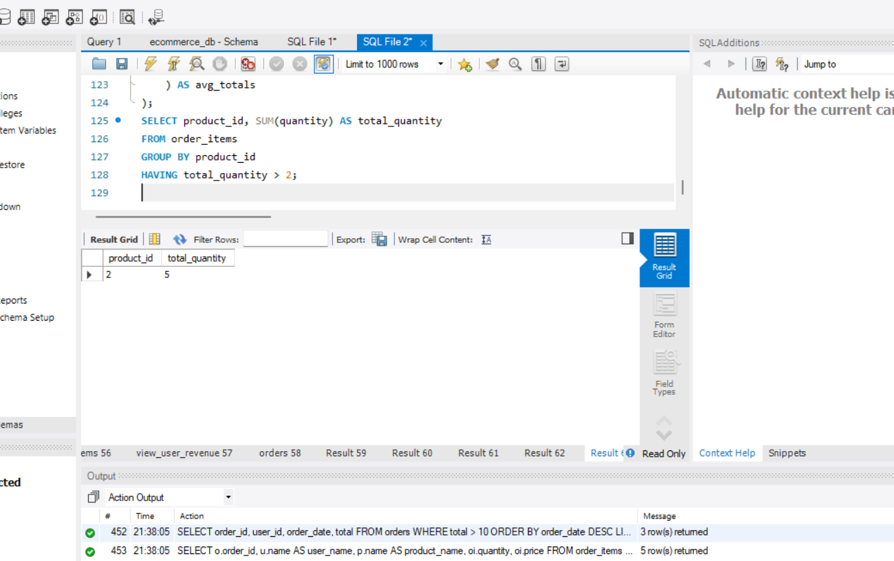
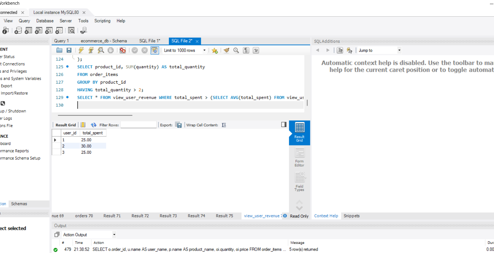
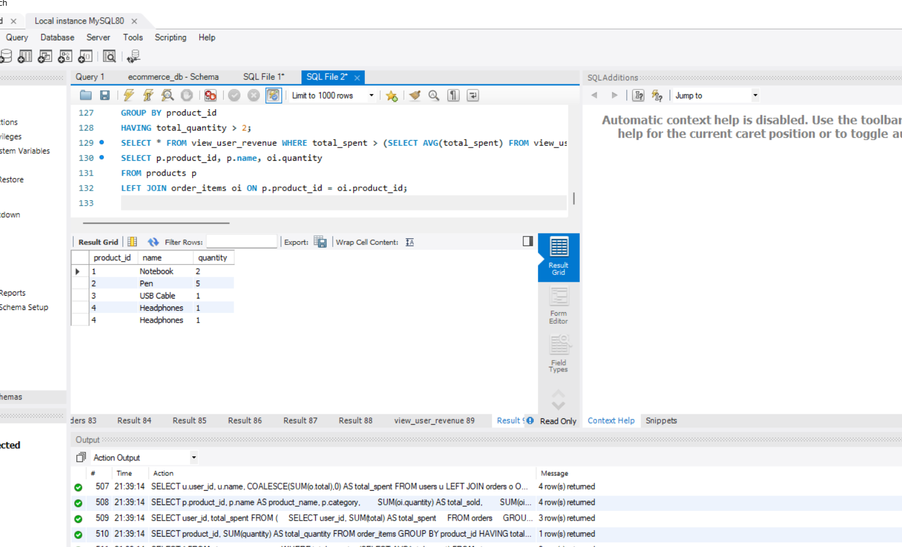

# task-4
# Task 4 – SQL for Data Analysis (Ecommerce Database)

## Objective
The goal of this task is to extract and analyze data from a structured database using SQL queries.  
We use an **Ecommerce database** with users, products, orders, and order items.

---

## Database Setup

### Tables Created
1. **users** – User information (ID, name, email, signup date)  
2. **products** – Product details (ID, name, category, price)  
3. **orders** – Orders made by users (ID, user_id, order_date, total)  
4. **order_items** – Items in each order (ID, order_id, product_id, quantity, price)  

### Sample Data
- 4 users, 4 products, 5 orders, 5 order items.

### Views and Indexes
- **View:** `view_user_revenue` – total spent per user  
- **Indexes:** `idx_orders_user_id`, `idx_orderitems_product_id` for faster queries

---

## Queries Implemented

### 1. SELECT with WHERE + ORDER BY
```sql
SELECT * FROM orders WHERE total > 10 ORDER BY order_date DESC;
```
**Screenshot:** 

---

### 2. INNER JOIN (orders + users + products)
```sql
SELECT o.order_id, u.name AS user_name, p.name AS product_name, oi.quantity, oi.price
FROM order_items oi
INNER JOIN products p ON oi.product_id = p.product_id
INNER JOIN orders o ON oi.order_id = o.order_id
INNER JOIN users u ON o.user_id = u.user_id;
```
**Screenshot:** 

---

### 3. LEFT JOIN + Aggregation
```sql
SELECT u.user_id, u.name, COALESCE(SUM(o.total),0) AS total_spent
FROM users u
LEFT JOIN orders o ON u.user_id = o.user_id
GROUP BY u.user_id, u.name
ORDER BY total_spent DESC;
```
**Screenshot:** 

---

### 4. GROUP BY + Aggregate
```sql
SELECT p.product_id, p.name AS product_name, p.category,
       SUM(oi.quantity) AS total_sold,
       SUM(oi.quantity * oi.price) AS revenue
FROM order_items oi
JOIN products p ON oi.product_id = p.product_id
GROUP BY p.product_id, p.name, p.category
ORDER BY total_sold DESC;
```
**Screenshot:** 

---

### 5. Subquery Example
```sql
SELECT user_id, total_spent
FROM (
    SELECT user_id, SUM(total) AS total_spent
    FROM orders
    GROUP BY user_id
) AS user_totals
WHERE total_spent > (
    SELECT AVG(total_spent)
    FROM (
        SELECT user_id, SUM(total) AS total_spent
        FROM orders
        GROUP BY user_id
    ) AS avg_totals
);
```
**Screenshot:** 

---

### 6. HAVING Clause Example
```sql
SELECT product_id, SUM(quantity) AS total_quantity
FROM order_items
GROUP BY product_id
HAVING total_quantity > 2;
```
**Screenshot:** 

---

### 7. Using View `view_user_revenue`
```sql
SELECT * FROM view_user_revenue WHERE total_spent > (SELECT AVG(total_spent) FROM view_user_revenue);
```
**Screenshot:** 

---

### 8. RIGHT/LEFT JOIN Example (Optional)
```sql
SELECT p.product_id, p.name, oi.quantity
FROM products p
LEFT JOIN order_items oi ON p.product_id = oi.product_id;
```
**Screenshot:** 

---

## How to Run
1. Open MySQL Workbench and connect to your server.  
2. Run the master SQL script `task4_master.sql` (creates database, tables, inserts data, view, indexes).  
3. Run the queries above in a new SQL tab.  
4. Take screenshots of outputs and save in `/screenshots/`.  
5. Commit and push everything to GitHub.  

---

## Tools Used
- **Database:** MySQL 8+  
- **IDE:** MySQL Workbench  
- **SQL Features Used:** SELECT, WHERE, ORDER BY, GROUP BY, HAVING, JOINs, subqueries, aggregate functions, views, indexes  

---

## Notes
- All queries are compatible with MySQL Workbench.  


